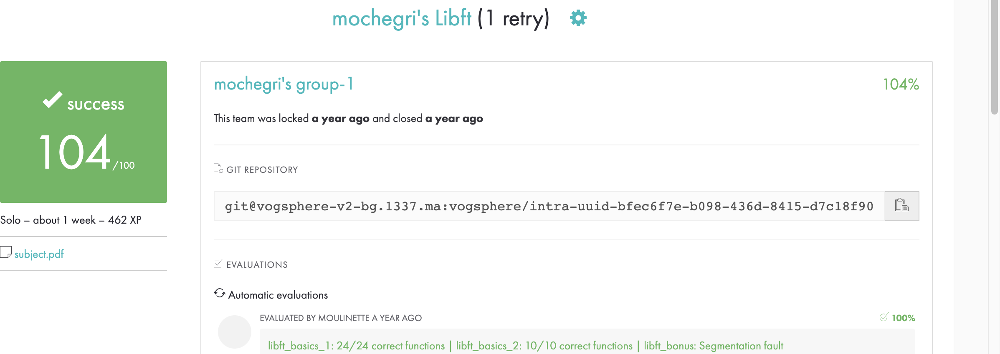

# libft

## Description
This project is your very first project as a student at 42. You will need to recode a few functions of the C standard library as well as some other utility functions that you will use during your whole cursus.

## Objectives
Unix logic

## Skills
Imperative programming
Algorithms & AI
Rigor

# project page

